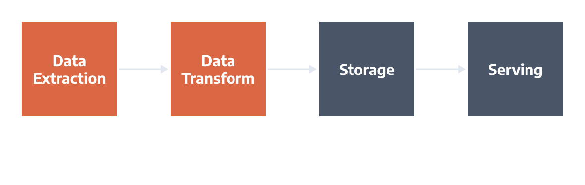
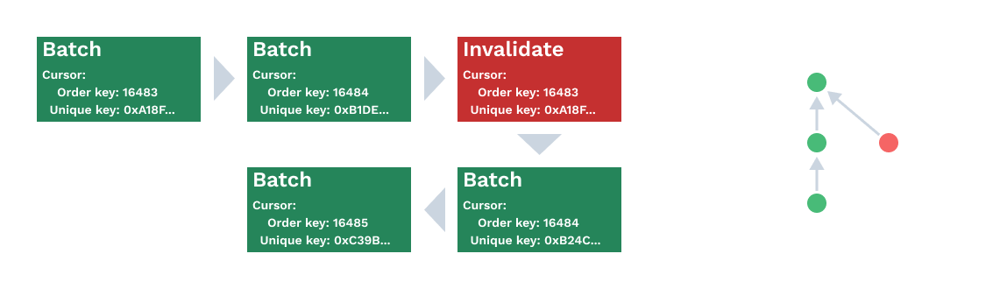

# Direct Node Access

This page describes Apibara's Direct Node Access (DNA) protocol implementation.
DNA enables developers to quickly build indexers that have excellent indexing
performance out of the box.

Decentralized applications need to show data to users in a very different
format from how nodes store the data. To solve this problem, developers have
been building *indexers* that read and transform on-chain data block by block
and then store it in an external database. Applications query data through an
API (REST, GraphQL) or directly accessing the database.

At a high level, indexing involves four steps:

- **Data Extraction:** read and filter data from the blockchain node, such as
  geth or erigon.
- **Data Transformation:** transform data from the low-level binary
  representation used by nodes to a higher-level one.
- **Storage:** write the new data into a database by connecting directly to the
  database or through an external API.
- **Serving data:** application data is provided through an API or directly to
  users.

The DNA protocol focuses on the data extraction and transformation steps.

## Background

#### Node Storage

Before we look at DNA in detail, we need to step back and understand how nodes
store block data and how developers access this data. We consider Ethereum
clients based on Erigon
([Erigon](https://github.com/ledgerwatch/erigon), [Akula](https://github.com/akula-bft/akula), [Silkworm](https://github.com/torquem-ch/silkworm)),
but the general concepts apply to all nodes.

Erigon stores data in a key-value database. Block data is split into tables
using the block number and hash as the key. The most relevant tables to
developers are the following:

- Headers (key = block number + hash): contains the full block headers, encoded
  as [RLP](https://ethereum.org/en/developers/docs/data-structures-and-encoding/rlp/).
  Headers include information like the parent hash, the block timestamp the
  amount of gas used.
- Canonical Header (key = block number): contains the hash of the canonical
  header at the given block height. Chain reorganizations can change what
  blocks are part of the canonical chain at any time. This table tracks what
  block (identified by its hash) is considered part of the canonical chain.
- Block Body (key = block number + hash): contains the list of transactions in
  the block.
- Receipts (key = block number): contains the receipts (transaction status, gas
  used, and logs) of all transactions in the block. Notice that Erigon stores
  receipts only for canonical blocks, so only the block number is used as the
  key.

Developers building indexers must run nodes in *archive mode*, storing block
state data for all nodes in the chain's history. Archive nodes require several
terabytes of disk space, making them very expensive.

#### Node Data Access

Developers don't access the node data by interacting with the database but
instead use the JSON-RPC API. JSON-RPC is the standard to communicate between
clients and nodes and [follows a well-defined
spec](https://ethereum.org/en/developers/docs/apis/json-rpc/). JSON-RPC is
based on web technologies like HTTP and WebSockets, so it's easy to use from
any language and web browser. The disadvantage of this approach is that
fetching data is very slow, often taking tens of milliseconds to receive a
single data point.

Erigon provides a *remote KV protocol* to access the raw tables in the node
through gRPC. This extremely low-level protocol enables developers to access
any table without going through JSON-RPC. As we will see later, the Ethereum
implementation of DNA uses this protocol to access data in the node.

#### Building Indexers

This section describes the most common strategies when it comes to building indexers.

The most straightforward approach is to ingest application data block by block
using JSON-RPC. This approach works well but presents several downsides that
teams need to handle:

- Must check for chain reorganizations and promptly invalidate data. Teams need
  to write, test, and maintain more code.
- Lengthy syncing time. At an average of 100ms per block, it takes three weeks
  to index all Ethereum blocks.

There are different ways to work around these two challenges. The first
approach is to split data ingestion from processing by storing block data in an
intermediate queue:

- Store block data in a **relational database** like PostgreSQL. Block
  processors read data row by row (or in batches) from the database, reducing
  latency.
- Use an **event-streaming platform** like Apache Kafka or Amazon Kinesis. Data
  is consumed by consuming the queue directly or using big data applications
  like Apache Flink.

Both approaches have been successfully used in practice by teams. These
approaches' main downside is considerably increasing development and deployment
complexity, especially if Apache Kafka and Flink are involved.

A different approach, adopted by the Graph Protocol with their Firehose
project, is to run a modified node that pushes block data to an external data
lake like Amazon S3. Indexers stream block data from the data lake and filter
the relevant application data. This approach works very well for *dense* data
(when the indexer is interested in most of the data contained in a block) but
performs poorly for *sparse data* (when the indexer is interested in specific
data only, for example, only events from one particular smart contract).

A final approach is to create a purpose-built node that includes routines to
index data. The indexer is implemented inside the node, usually as an
additional stage of the syncing process. When the node is syncing with the
network, it executes the custom indexer for each block and inserts new entries
in the database. Teams can then extend the node's JSON-RPC API to include
application-specific queries. Examples of nodes that provide this feature
include [Aptos](https://aptos.dev/guides/indexing/#define-your-own-data-model) and
Paradigm's [Reth](https://github.com/paradigmxyz/reth). The downside of this
approach is that an archive node cannot be shared between multiple indexers,
making every indexer very expensive to run.

## Direct Node Access (DNA)

Based on our learning building indexers using the patterns discussed in the
previous section, we set the goal to design a new developer tool optimized for
teams building indexers. The result is the Direct Node Acces protocol presented
in this section.

We had the following design goals for DNA:

- Stream-based to deliver new data to clients with minimal latency.
- Detect chain reorganizations automatically, giving clients a linear view of
  the chain.
- Must support pending data to implement optimistic updates.
- Extendable to include dynamic data like contract calls or automatic event
  decoding.
- Simple to get started and with a cognitive overhead comparable to JSON-RPC
  but with the same performance as a binary stream of data.
- Integrates well with existing developers' tools and programming languages.
- Easy to operate in production. Teams can reuse their knowledge of running
  execution clients to run DNA servers.

DNA is *stream-based*; the server sends data to the client through a binary
stream. Streams are critical for applications that require low latency since it
enables the server to send new data as soon as it becomes aware of a new
block. **Blockchain data is not immutable**: the network can *reorganize* the
most recent blocks in the chain. The DNA protocol includes the concept of *data
finality* and *cursors.*

- Data finality: blocks are marked as finalized if a chain reorganization
  cannot invalidate them. This property is chain specific.
- Cursor: every block has a unique cursor, usually combining the block number
  and hash. We call the block number *order key* because it gives a sequential
  ordering to blocks in a chain. The block hash is a *unique key* because it
  uniquely denotes a block.

Cursors are attached to all messages in the DNA protocol and provide
information about the current position in the chain. Indexers use cursors to
detect if any chain reorganization happened while offline.

As the name implies, DNA provides direct access to any data available in a
node. DNA enables developers to describe the data type they need
through *filters*; the DNA server then sends only data that matches the filter
to the client. The advantage of this approach is twofold:

- Less bandwidth is required, resulting in faster client indexing speed and
  cheaper server egress charges.
- Developers can use the data as-is without the need to filter it further in
  their programme. Integrating DNA streams into other applications is easier
  because the data is piped to the application directly.

Filters are a critical component of DNA and work as follows:

- They specify whether to include single-block elements (like block headers).
  These components can be *weak*: DNA includes them only if any other filter
  matches.
- Subfilters can restrict the data sent by providing constraints on the field
  they represent. For example, a transaction filter can limit the sender's
  address to a specific address. Developers can include multiple subfilters to
  retrieve the data needed for each block.

Developers can *reconfigure* DNA streams while data is streaming. For example,
a stream may start by tracking the Uniswap V3 factory and adding filters for
every Uniswap Pair deployed.

Projects strive to make their applications feel as responsive as possible since
that leads to better user experience and user retention. DNA enables developers
to use *pending data* to build *negative latency indexers*. The DNA stream
starts sending pending data after the stream has reached the tip of the chain.
From the client's point of view, each pending-accepted block pair is equivalent
to a mini-chain reorganization.

The definition of the DNA protocol is open-ended; we want developers to
experiment with new ways to enrich on-chain data. For example, it's possible to
add a mechanism to automatically decode transaction events based on the
contract ABI provided by the client. DNA streams can integrate further with
nodes and provide the ability to perform *streaming calls*; the stream contains
changes in the return value of an EVM call specified by the client.

## DNA in practice

Now that we have looked at the DNA design let's look at the implementation of
the DNA protocol by Apibara.

We use gRPC as the underlying RPC protocol because it balances efficiency and a
complete developer ecosystem well. The protocol defines a simple `Stream`
service the client uses to initiate streaming data. The stream starts as soon
as the client sends an initial configuration. Since the server-to-client
communication is async, we introduce *stream ids.* Stream ids solve the issue
when the client sends a new configuration to the server, but the server has
already queued several messages using the old configuration. Clients can detect
a message's configuration by inspecting the stream id property attached to
every message. In the real world, connections are often unstable, and streams
can hang indefinitely without receiving new messages or disconnecting. The DNA
protocol includes *heartbeat* messages sent from the server to the client every
30 seconds to confirm that the stream is still connected and working. Clients
detect a broken connection if they don't receive any new message for at least
the heartbeat interval. A more detailed overview of the DNA gRPC protocol is
available [in our documentation](/docs/streaming-protocol).

The EVM DNA implementation uses Erigon as the base execution client. We decided
to base our design on Erigon for two main reasons:

- Low disk footprint thanks to their well-designed database. Running an Erigon
  archive node is drastically cheaper than other nodes.
- The remote KV API allows access to the data without changing the node code.

The Erigon DNA server is a stateless and lightweight server that runs alongside
Erigon. The server translates the high-level streaming protocol into
lower-level calls to the KV store.

The final component of DNA is a collection of SDKs and tools to integrate
on-chain data into applications and developer tools. We want developers to keep
using the tools they already know and love, so we built DNA thinking about
integrations from day 1. For example, a program can stream data into a database
(PostgreSQL, Google Big Query, or Snowflake) and keep it updated.

## Conclusion

This page presented the main ideas behind the Direct Node Access protocol. We
started by looking at how teams implement indexers in practice and analyzing
the downsides of each approach. We then showed how DNA solves these issues in
practice and enables developers to build high-performance indexers that are
easy to maintain.

If you're interested in helping us improve Apibara, don't hesitate to get in
touch with us [on Twitter at @apibara_web3](https://twitter.com/apibara_web3)
or [on GitHub](https://github.com/apibara/dna)!

