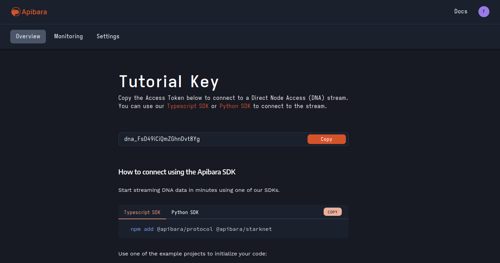

# Getting Started with Apibara

Apibara is the easiest way to build production-grade indexers:

- **Stream** onchain data into your indexer, receiving exactly the data you need.
- **Transform** the data into a higher-level representation that maps to your application domain.
- **Integrate** data with the rest of your application by sending it to other services.

This page will guide you in setting up your development environment for Apibara
and writing your first indexer.

## Install the CLI tool

Install the `apibara` CLI by running the following command. Note that you need
`jq` install for this to work. Alternatively, you can download the CLI from our
[release page](https://github.com/apibara/dna/releases) and manually add it to
your `$PATH`.

```bash
curl -sL https://install.apibara.com | bash
```

After this, create a new terminal and check that `apibara` is installed:

```bash
$ apibara --version
apibara-cli 0.4.0
```

## Managing plugins

Apibara doesn't include any integration out of the box. Integrations are a
special type of plugin and are managed using the CLI.

List the installed plugins using the following command. Note that, as expected,
no plugin is installed.

```bash
$ apibara plugins list
```

We use the `apibara plugins install` command to download and install plugins
from GitHub.
At the moment, the following plugins are available:

- `sink-console`: useful for debugging indexers by printing the output of the
  transformation step to the standard output.
- `sink-webhook`: invoke a webhook with the result of the transformation.
- `sink-postgres`: continuously insert data in the target table.
- `sink-mongo`: continuously insert data in the target collection.
- `sink-parquet`: create Parquet datasets.

For example:

```bash
$ apibara plugins install sink-console
Found release Console Sink v0.1.0
Downloading sink-console-x86_64-linux.gz...
Plugin console installed to /home/user/.local/share/apibara/plugins/apibara-sink-console
```

```bash
$ apibara plugins list
#  mongo     sink  0.1.0
#  postgres  sink  0.1.0
#  webhook   sink  0.1.0
#  console   sink  0.1.0
#  parquet   sink  0.1.0
```

## Creating an Apibara account and API Key

Head over to the [registration page](https://app.apibara.com/auth/register) to
create an Apibara account.


From your dashboard, click on the "New Indexer" button and then select "DNA Key".
Choose a memorable name for your API Key and then click "Deploy Indexer".


Finally, copy the API Key to your clipboard. Notice that you can come back to this
page at any time from your dashboard.



As we will see in the next section, you will need the API Key to authenticate
with the data streams hosted by Apibara.

## Setting up your environment

Apibara indexers are powered by Deno, a Javascript/Typescript runtime. Deno has
excellent editor/IDE support, so it's easy to setup your environment to have
autocomplete and formatting.

[Refer to the Deno documentation to learn how to setup your editor, including
VS Code, JetBrains IDEs, Vim/Neovim, and
Emacs](https://deno.land/manual/getting_started/setup_your_environment).

## Your first indexer

Indexers are implemented as Javascript or Typescript scripts.
Scripts need to export two things:

- a `config` object that contains the indexer configuration.
- a default function, used to transform each batch of data streamed by Apibara.

A minimal script looks like the following:

```js
export const config = {
  streamUrl: "https://goerli.starknet.a5a.ch",
  startingBlock: 800_000,
  network: "starknet",
  finality: "DATA_STATUS_ACCEPTED",
  filter: {
    header: {},
  },
  sinkType: "console",
  sinkOptions: {},
};

// This transform does nothing.
export default function transform(block) {
  return block;
}
```

You can run it using the `apibara run` command. Notice that you need a free API
key from Apibara to consume the hosted stream.

```bash
$ apibara run script.js -A  dna_xxx
```

<<<<<<< Updated upstream
||||||| Stash base

=======
The indexer script is a self-contained script that is used by Apibara to
configure and transform the data stream. If you try to run the script directly
using, for example, Node.js or Bun it will not do anything.

>>>>>>> Stashed changes
## Configuration

The `config` object accepts the following properties:

- `streamUrl`: the stream URL. Usually it's one of the Apibara hosted streams,
  but you can point it to a self-hosted stream.
- `startingBlock`: start streaming data from this block.
- `network`: the type of network, e.g. `starknet` to stream data from Starknet
  or a Starknet-based appchain.
- `finality`: data status finality. Can be one of `DATA_STATUS_PENDING`,
  `DATA_STATUS_ACCEPTED`, or `DATA_STATUS_FINALIZED`. Defaults to accepted.
- `filter`: the filter used to select onchain data. See the "Networks" section
  in the sidebar to see which networks and data are available.
- `sinkType`: send data to the specified sink plugin. See the "Integrations"
  section in the sidebar to see which sinks are available.
- `sinkOptions`: options used to configure the sink.

## Deno Javascript Runtime

Apibara scripts are executed in a secure Deno runtime. The Deno runtime
implements support for both Javascript and Typescript. At the moment,
there are some differences compared to a traditional Node.js runtime:

- Dependencies are imported directly from a CDN.
- There is no file-system access.
- There is no network access. If you need it, you can use Apibara to enqueue
  tasks to a job queue like Inngest.
- Access to environment variables must be explicitly granted.

### Installing dependencies

Unlike Node.js, Deno doesn't manage dependencies through a `package.json` file but they must
be imported through a CDN. We recommend [ESM.run/JsDelivr](https://www.jsdelivr.com/esm).

```js
import { hash, uint256 } from "https://esm.run/starknet@5.14";
import { formatUnits } from "https://esm.run/viem@1.4";
```

One common pattern is to create a `deps.ts` file and import all dependencies
from this file, re-exporting the functions and classes needed by your
application. Refer to the official [Deno documentation to learn more about
managing
dependencies](https://deno.land/manual@v1.36.1/examples/manage_dependencies).

### Environment variables

The Deno runtime used by Apibara doesn't allow access to environment variables
by default for security reason.

You can expose environment variables to your indexer by creating a `.env` file
and passing the `--allow-env=.env` flag to `apibara run`. Environment variables
are read using the `Deno.env.get` function.

For example, create the following `testnet.env` file:

```env
export TOKEN_ADDRESS=0x049d36570d4e46f48e99674bd3fcc84644ddd6b96f7c741b1562b82f9e004dc7
export TOKEN_DECIMALS=18
```

Then you can access these variables from your script:

```js
const ADDRESS = Deno.env.get("TOKEN_ADDRESS");
const DECIMALS = Deno.env.get("TOKEN_DECIMALS");
```

Then run it with:

```bash
$ apibara run --allow-env=testnet.env script.js
```

**Note:** the `--allow-env` flag must come before the script name.
