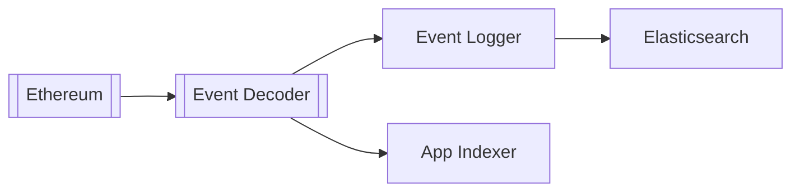

# Apibara documentation

Apibara is a framework to stream and transform on-chain data. Apibara is used to
integrate on-chain data into applications, either using the provided SDKs or
through integrations.

At the lowest-level, Apibara provides the Direct Node Access (DNA) [streaming
protocol](/docs/dna) used to stream data from the nodes.
Developers choose any on-chain data (for example: transactions, receipts,
storage changes) and stream it into their application at high speed (up to
several thousands blocks per second) and low latency.
The DNA protocol supports [streaming pending blocks](/docs/pending-data) to
ingest data before it's confirmed on-chain, reducing the latency visible to
users.

## Why Apibara

Here are a few reasons why Apibara is a great choice to build your project’s data pipeline:

 - The protocol is extremely lean and based on gRPC, resulting in very low
latency when ingesting real-time data.
 - The protocol supports advanced features like streaming data _before_ it's
 produced on chain, enabling optimistic updates into your application.
 - The protocol is composable, it encourages other developers to build on top of
 your application.
 - You can build applications using any language that supports gRPC, leveraging
 your team’s existing skills.
 - Apibara is [completely open-source](https://github.com/apibara/dna) so you
 don’t have to worry about vendor lock-in.

### Getting started

 - [High-level overview](/docs/overview): learn the philosophy behind Apibara.
 - [Python SDK](/docs/python-sdk): get started with the Python SDK.
 - [Typescript SDK](/docs/typescript-sdk): get started with the Typescript SDK.

### Getting help

  - [Chat with our developers on Discord](https://discord.gg/m7B92CNFNt)
  - [Open an issue on GitHub](https://github.com/apibara)
  - [View service status](https://apibara.statuspage.io/)
