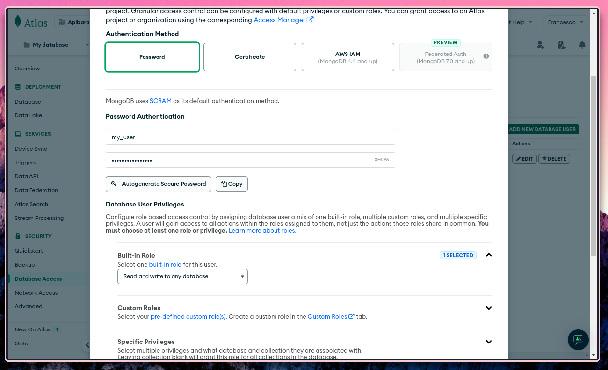
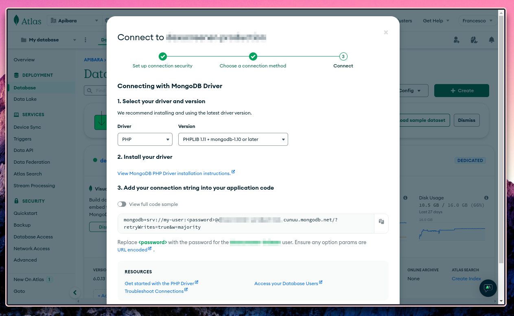

# How to synchronize onchain data to MongoDB Atlas

This guide will show you how to synchronize onchain data to your MongoDB Atlas
instance.

## Create a new database user

From your MongoDB Atlas dashboard, create a new database user by clicking on "Database access" and then "Add new database user".

1. Select the "Password" authentication method,
2. Pick a username and password,
3. Select the "Read and write to any database" built-in role,
4. Finally, click "Add user".



## Grab the connection string

Back on your dashboard, select "Database" , then "Connect" and then "Drivers". The specific driver language and version is not important,
simply copy the connection string shown in the modal window.



## Connect the indexer

Set the `MONGO_CONNECTION_STRING` environment variable to the value copied from
the dashboard.

```bash [Terminal]
export MONGO_CONNECTION_STRING="mongodb+srv://[YOUR-USER]:[YOUR-PASSWORD]@[YOUR-INSTANCE].cunuu.mongodb.net/?retryWrites=true&w=majority"
```

Run the indexer and after a few seconds you will see onchain data appear in your
database.
