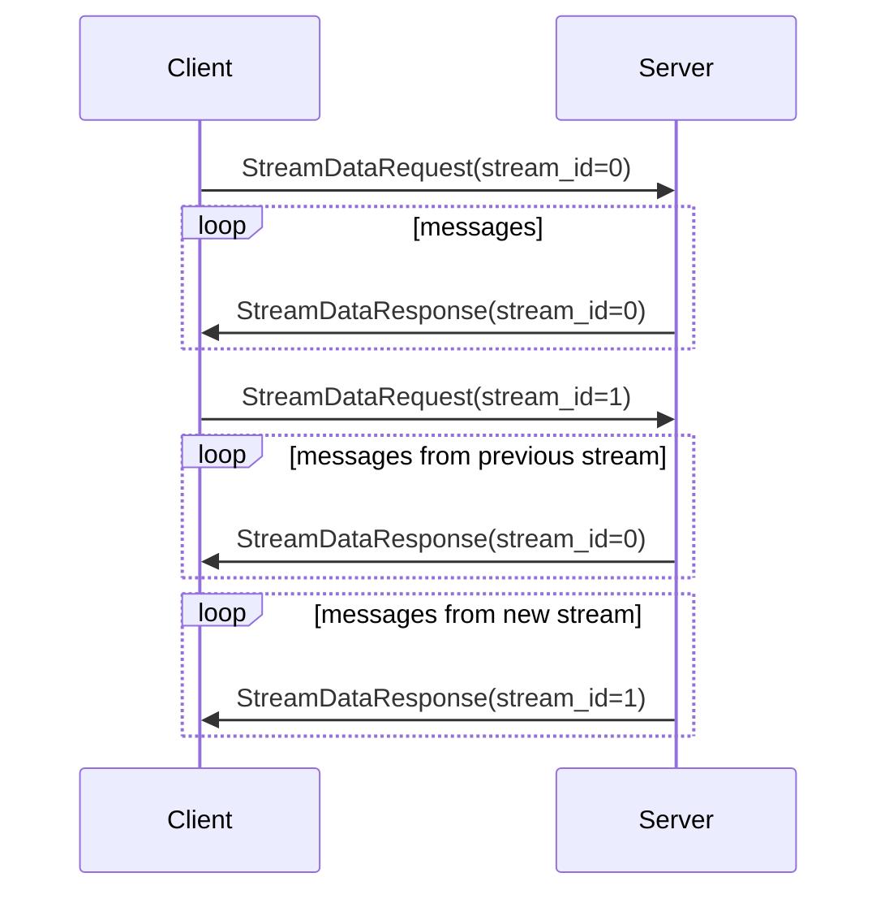

The Direct Node Access (DNA) streaming protocol is used to efficiently stream
any on-chain data from nodes into applications.

The goals of the protocol are:

 - linearize non-linear data into something easy to follow,
 - let clients customize the data they want to receive, reducing the bandwidth required,
 - provide support for data at all stages of finality (pending, accepted, finalized).

## Getting started with DNA

If you're using the hosted version of DNA, you need to create a free DNA access token from [the Apibara dashboard](https://app.apibara.com/).

Once you have the token, create a new project in your target language (like Typescript or Python) and install the Apibara SDK.

<CodeBlock.Multi>
  <CodeBlock.Language language="Typescript SDK">
    ```txt
    npm add @apibara/protocol @apibara/starknet
    ```
  </CodeBlock.Language>
  <CodeBlock.Language language="Python SDK">
    ```txt
      poetry add apibara
    ```
  </CodeBlock.Language>
</CodeBlock.Multi>

Use one of the example projects to initialize your code:

 - [Typescript SDK starter project](https://github.com/apibara/typescript-sdk/tree/main/examples/simple-client)
 - [Python SDK with indexer abstraction](https://github.com/apibara/python-sdk/blob/main/examples/starknet_indexer.py)
 - [Simple Python SDK](https://github.com/apibara/python-sdk/blob/main/examples/simple_client.py)

All starter project read the DNA authentication token from the environment, **it's highly discouraged to commit the access token into the repository**.

<CodeBlock.Multi>
  <CodeBlock.Language language="Typescript SDK">
    ```ts
    import { StreamClient } from '@apibara/protocol'

    // Read token from environment
    const AUTH_TOKEN = process.env.AUTH_TOKEN

    // Use token when streaming data
    const client = new StreamClient({
      url: 'mainnet.starknet.a5a.ch',
      token: AUTH_TOKEN,
    })
    ```
  </CodeBlock.Language>
  <CodeBlock.Language language="Python SDK (Indexer)">
    ```py
    import os

    from apibara.indexer import (
      IndexerRunner, IndexerRunnerConfiguration)

    # Read token from environment
    AUTH_TOKEN = os.environ.get("AUTH_TOKEN")

    # Configure indexer runner
    runner = IndexerRunner(
        config=IndexerRunnerConfiguration(
            stream_url="mainnet.starknet.a5a.ch:443",
            storage_url="<storage-url>",
            token=AUTH_TOKEN,
        ),
        reset_state=args.reset,
    )
    ```
  </CodeBlock.Language>
  <CodeBlock.Language language="Python SDK">
    ```py
    import os

    from grpc import ssl_channel_credentials
    from grpc.aio import secure_channel

    from apibara.protocol import (
      StreamAddress, StreamService, credentials_with_auth_token)

    # Read token from environment
    AUTH_TOKEN = os.environ.get("AUTH_TOKEN")

    # Create authenticated grpc channel
    channel = secure_channel(
        StreamAddress.StarkNet.Mainnet,
        credentials_with_auth_token(AUTH_TOKEN, ssl_channel_credentials()),
    )

    # Create stream client from channel
    (client, stream) = StreamService(channel).stream_data()
    ```
  </CodeBlock.Language>
</CodeBlock.Multi>

## The protocol


The client starts by calling the `StreamData` method in the `Stream` gRPC service.
The client must send a `StreamDataRequest` message to the server to start the stream.

The request includes:
 - `stream_id`: unique id for the stream. All messages generated in response to this request will have the specified stream id, or 0 if not specified.
 - `starting_cursor`: specifies from where to start the stream. The cursor is stream-specific.
 - `finality`: specifies the finality required by the client. This parameter changes the behavior of the stream.
 - `filter`: specifies what type of data the client wants to receive. This is specific to each stream.

After the client requests data, the stream will start sending `StreamDataResponse` messages to the client.
The messages can have the following content:

 - `invalidate`: invalidates data previously sent, for example in response to chain reorganizations.
 - `data`: sends a new batch of data.
 - `heartbeat`: periodically sent if no other types of messages were produced. Used to confirm that the client and server are still connected.

The client can reset the stream by sending a new `StreamDataRequest`. The server will stop sending data for the previous request and will start sending data for the new stream.
Notice that because the flow is async, the client may still receive messages from the old stream definition. Use the `stream_id` to uniquely identify streams.




### Data finality

The DNA protocol supports streaming data with different finality. The stream
behaves differently based on the finality mode specified in the request:

 - `finalized`: the stream sends `data` messages for finalized data only. The `data` messages contain the data requested in the stream filter. Notice that there cannot be `invalidate` messages in this type of stream.
 - `accepted`: the stream sends `data` messages for accepted data (including historical finalized data).
 - `pending`: the stream sends `data` messages for pending data and for accepted data. Notice that the client may receive the same pending data multiple times.


### Cursor

Cursors are used to identify a location in a stream. The `end_cursor` in `Data`
messages refers to the location of the latest piece of data in the stream. When
clients send this cursor as a `starting_cursor` in a request, the server will
resume streaming by sending the first message that _follows_ the provided
cursor. When no `starting_cursor` is specified, the stream will start from the
genesis block.  If the data in or before `end_cursor` was invalidated (following
a chain reorganization), the server will inform the client of it and will resume
the stream from the new stream's head.

A `Cursor` is made of two components:

 - `order_key`: this is the sequence number for messages,
 - `unique_key`: this is used to discriminate between data generated from
 different blocks at the same height.


## Protobuf specification

This section includes the `stream.proto` file containing the specification of
the `Stream` gRPC service.


```protobuf
// Apibara Stream service.
syntax = "proto3";

package apibara.node.v1alpha2;

service Stream {
  // Stream data from the node.
  rpc StreamData(stream StreamDataRequest) returns (stream StreamDataResponse);
}

// Request data to be streamed.
message StreamDataRequest {
  // Used by the client to uniquely identify a stream.
  // All streams use `stream_id = 0` by default.
  optional uint64 stream_id = 1;
  // How many items to send in a single response.
  optional uint64 batch_size = 2;
  // Start streaming from the provided cursor.
  Cursor starting_cursor = 3;
  // Return data with the specified finality.
  // If not specified, defaults to `DATA_STATUS_ACCEPTED`.
  optional DataFinality finality = 4;
  // Return data according to the stream-specific filter.
  bytes filter = 5;
}

// Contains the data requested from the client.
message StreamDataResponse {
  // The stream id.
  uint64 stream_id = 1;
  oneof message {
    Invalidate invalidate = 2;
    Data data = 3;
    Heartbeat heartbeat = 4;
  }
}

// A cursor over the stream content.
message Cursor {
  // Key used for ordering messages in the stream.
  uint64 order_key = 1;
  // Key used to discriminate branches in the stream.
  bytes unique_key = 2;
}

// Data finality.
enum DataFinality {
  DATA_STATUS_UNKNOWN = 0;
  // Data was received, but is not part of the canonical chain yet.
  DATA_STATUS_PENDING = 1;
  // Data is now part of the canonical chain, but could still be invalidated.
  DATA_STATUS_ACCEPTED = 2;
  // Data is finalized and cannot be invalidated.
  DATA_STATUS_FINALIZED = 3;
}

// Invalidate data after the given cursor.
message Invalidate {
  // The cursor of the message before the now invalid data.
  Cursor cursor = 1;
}

// A batch of data.
message Data {
  // Cursor of the last item in the batch.
  Cursor end_cursor = 1;
  // The finality status of the data in the batch.
  DataFinality finality = 2;
  // The stream data.
  repeated bytes data = 3;
  // Cursor used to produced the batch.
  Cursor cursor = 4;
}

// Sent to clients to check if stream is still connected.
message Heartbeat {}
```
